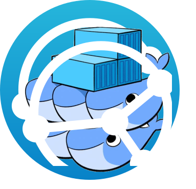

# Syncthing4Swarm

<p align="center">
  
</p>

<p align="center"><b>Replicate Docker volumes across your Swarm cluster — automatically
</b></p>

Syncthing4Swarm deploys [Syncthing](https://syncthing.net/) across a Docker Swarm cluster with automatic peer discovery and zero-touch configuration.

## Features

- **Global deployment**: one Syncthing instance on every Swarm node
- **Automatic discovery**: scans the overlay network to find other instances
- **Auto-configuration**: mutual device pairing and folder sharing without manual intervention
- **Private mode**: disables relays and global discovery (internal traffic only)

## Architecture

```
╔═══════════════════════════════════════════════════════════════════════════════╗
║                                 Docker Swarm                                  ║
║                                                                               ║
║  ┌─────────────────────┐   ┌─────────────────────┐   ┌─────────────────────┐  ║
║  │       Node 1        │   │       Node 2        │   │       Node 3        │  ║
║  │     ┌─────────┐     │   │     ┌─────────┐     │   │     ┌─────────┐     │  ║
║  │     │Syncthing│◄────┼───┼────►│Syncthing│◄────┼───┼────►│Syncthing│     │  ║
║  │     └────┬────┘     │   │     └────┬────┘     │   │     └────┬────┘     │  ║
║  │          │          │   │          │          │   │          │          │  ║
║  │ /var/syncthing/data │   │ /var/syncthing/data │   │ /var/syncthing/data │  ║
║  └─────────────────────┘   └─────────────────────┘   └─────────────────────┘  ║
║                                                                               ║
║                           Overlay network (internal)                          ║
╚═══════════════════════════════════════════════════════════════════════════════╝
```

## Requirement

- Initialized Docker Swarm (`docker swarm init`)

## Quick Start

Run on **each node**:

```bash
sudo mkdir -p /var/syncthing/data
```

Run only on **one node**:

```bash
# Clone the repository
git clone https://github.com/sammonsempes/syncthing4swarm.git
cd syncthing4swarm

# Deploy to Swarm
sudo docker stack deploy -c docker-compose.yml syncthing4swarm
```

## Configuration

Available environment variables that can be used in `docker-compose.yml`:

| Variable                   | Default               | Description                          |
| -------------------------- | --------------------- | ------------------------------------ |
| `STGUIAPIKEY`              | *required*            | API key for Syncthing interface      |
| `SYNCTHING_PORT`           | `8384`                | REST API port                        |
| `SYNCTHING_SYNC_PORT`      | `22000`               | Synchronization port                 |
| `SYNCTHING_FOLDER_ID`      | `shared`              | Shared folder identifier             |
| `SYNCTHING_FOLDER_PATH`    | `/var/syncthing/data` | Synchronized folder path             |
| `SYNCTHING_FOLDER_LABEL`   | `Shared`              | Display name for the folder          |

## How It Works

On each container startup:

1. Waits for Syncthing to become operational
2. Disables global features (relays, NAT, external discovery)
   - [`"globalAnnounceEnabled": false`](https://docs.syncthing.net/users/config.html#config-option-options.globalannounceenabled) Whether to announce this device to the global announce (discovery) server, and also use it to look up other devices.
   - [`"relaysEnabled": false`](https://docs.syncthing.net/users/config.html#config-option-options.relaysenabled) When `true`, relays will be connected to and potentially used for device to device connections.
   - [`"natEnabled": false`](https://docs.syncthing.net/users/config.html#config-option-options.natenabled) Whether to attempt to perform a UPnP and NAT-PMP port mapping for incoming sync connections.
   - [`"localAnnounceEnabled": true`](https://docs.syncthing.net/users/config.html#config-option-options.localannounceenabled) Whether to send announcements to the local LAN, also use such announcements to find other devices.
   - [`"progressUpdateIntervalS": -1`](https://docs.syncthing.net/users/config.html#config-option-options.progressupdateintervals) How often in seconds the progress of ongoing downloads is made available to the GUI. Set to `-1` to disable. Note that when disabled, the detailed sync progress for Out of Sync Items which shows how much of each file has been reused, copied, and downloaded will not work.
   - [`"setLowPriority": false`](https://docs.syncthing.net/users/config.html#config-option-options.setlowpriority) Syncthing will attempt to lower its process priority at startup. Specifically: on Linux, set itself to a separate process group, set the niceness level of that process group to nine and the I/O priority to best effort level five; on other Unixes, set the process niceness level to nine; on Windows, set the process priority class to below normal. To disable this behavior, for example to control process priority yourself as part of launching Syncthing, set this option to `false`.

3. Creates the shared folder if it doesn't exist
4. Scans the overlay subnet (`/24`)
5. Mutually adds all discovered devices with their static IP addresses
6. Syncs the device list across the shared folder
7. Sets the following folder settings in syncthing:
   - [`"rescanIntervalS": 3600`](https://docs.syncthing.net/users/config.html#config-option-folder.rescanintervals) Performs a full rescan ervery 3600 seconds (every hour).
   - [`fsWatcherEnabled: true`](https://docs.syncthing.net/users/config.html#config-option-folder.fswatcherenabled) If set to `true`, this detects changes to files in the folder and scans them.
   - [`"ignorePerms": false`](https://docs.syncthing.net/users/config.html#config-option-folder.ignoreperms) If `true`, files originating from this folder will be announced to remote devices with the “no permission bits” flag. The remote devices will use whatever their default permission setting is when creating the files. The primary use case is for file systems that do not support permissions, such as FAT, or environments where changing permissions is impossible.
   - [`"autoNormalize": true`](https://docs.syncthing.net/users/config.html#config-option-folder.autonormalize) Automatically correct UTF-8 normalization errors found in file names. The mechanism and how to set it up is described in a [separate chapter](https://docs.syncthing.net/advanced/folder-autonormalize.html).
   - [`"scanProgressIntervalS": -1`](https://docs.syncthing.net/users/config.html#config-option-folder.scanprogressintervals) The interval in seconds with which scan progress information is sent to the GUI. Setting to `0` will cause Syncthing to use the default value of two. If you don’t need to see scan progress, set this to `-1` to disable it.
   - [`"caseSensitiveFS": true`](https://docs.syncthing.net/users/config.html#config-option-folder.casesensitivefs) Affects performance by disabling the extra safety checks for case insensitive filesystems. The mechanism and how to set it up is described in a [separate chapter](https://docs.syncthing.net/advanced/folder-caseSensitiveFS.html).
   - [`"sendOwnership": true`](https://docs.syncthing.net/users/config.html#config-option-folder.sendownership) File and directory ownership information is scanned when this is set to `true`. See [sendOwnership](https://docs.syncthing.net/advanced/folder-send-ownership.html) for more information.
   - [`"syncOwnership": true`](https://docs.syncthing.net/users/config.html#config-option-folder.syncownership) File and directory ownership is synced when this is set to `true`. See [syncOwnership](https://docs.syncthing.net/advanced/folder-sync-ownership.html) for more information.
   - [`"maxConflicts": 0`](https://docs.syncthing.net/users/config.html#config-option-folder.maxconflicts) The maximum number of conflict copies to keep around for any given file. The default is `10`. `-1`, means an unlimited number. Setting this to `0` disables conflict copies altogether.
   - [`"fsWatcherDelayS": 1`](https://docs.syncthing.net/users/config.html#config-option-folder.fswatcherdelays) The duration during which changes detected are accumulated, before a scan is scheduled (only takes effect if fsWatcherEnabled is set to `true`).

## Exposed Ports

| Port  | Protocol | Usage                      |
| ----- | -------- | -------------------------- |
| 8384  | TCP      | REST API                   |
| 22000 | TCP/UDP  | File synchronization       |
| 21027 | UDP      | Local discovery            |

## Development

Run on **each node**:

```bash
sudo mkdir -p /var/syncthing/data

# Clone the repository
git clone https://github.com/sammonsempes/syncthing4swarm.git
cd syncthing4swarm/dev

# Build image
sudo docker build -t syncthing4swarm:local .
```

Run only on **one node**:

```bash
# Deploy to Swarm
sudo docker stack deploy -c docker-compose-dev.yml syncthing4swarm

# Watch how syncthing connects itself with other nodes.
# Initial setup takes about 5 minutes to finish
sudo docker service logs syncthing4swarm_syncthing4swarm -f

## Testing ...

# Remove stack
sudo docker stack rm syncthing4swarm
```

Run on **each node**:

```bash
# Remove dev image from local image repository
sudo docker image rm syncthing4swarm:local
```

## Acknowledgments

This project is built on top of [Syncthing](https://github.com/syncthing/syncthing), an amazing open-source continuous file synchronization program. Huge thanks to the Syncthing contributors for their incredible work.

This project was inspired by [docker-swarm-syncthing](https://github.com/bluepuma77/docker-swarm-syncthing) by bluepuma77.
